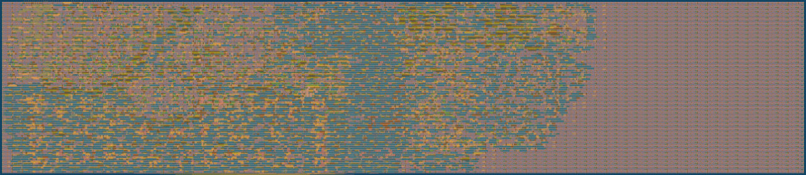

# PROE_WGR-V

**"Projektarbeit E" von Tobias Kling und Philip Mohr – FH Kiel 2025**

Dieses Repository enthält einen RISC-V Prozessor und Peripherie in Verilog, sowie die dazugehörigen Werkzeuge, Skripte und Tests.

---

## Projektstruktur

### 📂 `/WGR-V-MAX`

Hier befinden sich die nötige Ordnerstruktur, um das Projekt mit Quartus zu verwendet.
- **IP**: Enthält FPGA-RAM Dateien (`altsyncram`).
- **mem**: Speicherinitialisierungs Datei (`wgr_flat.hex`)
- **tb_sim**: Testbench für die Simulation mit Questa.

Die RAM-Komponente wird initial mit einer `.hex` Datei geladen.
Da die von `objdump` erstellten `.hex` Datein nicht direkt in Quartus verwendet werden können, muss die Datei mit `.conv_hex.py` konvertiert werden.

### 📂 `/rtl`

Enthält den Kern des RISC-V Prozessors.
- `cpu.v`: Kernmodul des RISC-V Prozessors.
  - Implementiert das RV32I/RV32E Basis Instruction-Set.
  - Alle Instruction-Bestandteile als localparam zum besseren Verständnis enthalten (z.B. `localparam F3_BLTU = 3'b110,`).
  - Kann durch `mem_busy` Signal halten, wenn der verwendete RAM länger als einen Taktzyklus braucht.
- `alu.v`: ALU für das RV32I/RV32E Instruction-Set.
- `register_file.v`: 32 Bit Register Datei.
  - Kann einfach zwischen RV32I und RV32E umgebaut werden.
- `defines.v`: Enthält die CPU Frequenz.
  - `CLK_FREQ` muss an die verwendete Clock angepasst werden, damit UART-Baud, System-Timer etc. korrekt funktionieren.
- `wgr_v_max.v`: Top-Level Modul, das die Instanzen der CPU und vom Speicher verbindet.
  - Für die Simulation sind Signale wie `write_data[31:0]` nach außen geführt. Diese müssen entweder entfernt oder in Quartus als Virtual Pin gesetzt werden.

#### 📁 `/rtl/peripherals`
- `peripheral_bus.v`: Top-Modul für Peripherie-Module.
  - Selektiert Peripherie-Modul anhand der Addresse.
  - Write- und Read-Enable werden an jeweiligen Modul weitergereicht.
  - `address[12:8]` bestimmt die verwendete Peripherie.
  - `address[7:0]` wird an das selektierte Modul weitergereicht.
  - Die Daten für den Lesevorgang `read_data[31:0]` werden vom selektierten Modul weitergereicht.
- `uart.v`: Standard UART mit FIFO für TX und RX.
  -  Unterstützt Baudraten von 300 - 115200.
- `spi.v`: Standard SPI mit FIFO für TX und RX.
  - Unterstützt automatischen und manuellen Chip Select.
  - SPI Clock kann geteilt werden (Maximale SPI Clock: System Clock / 2).
- `pwm_timer.v`: 32 Bit Timer mit optionalem PWM Output.
  - Zusätzlicher 32 Bit Clock Teiler.
  - 50% Duty Modus aktivierbar.
- `debug_module.v`: Schreib- und lesbare Peripherie-Speicheradresse.
  - Wird für die Simulation bis an die Testbench weitergereicht.
- `system_timer.v`: Schreib- und lesbare Peripherie-Speicheradresse.
  - Durchgängig laufende Milli- und Mikrosekunden Zähler.
  - Können beide zurückgesetzt werden.
- `fifo.v`: FIFO für UART und SPI.
  - Einstellbare Breite und Tiefe.
- `gpio.v`: Standard GPIO.
  - Verwendet momentan `input gpio_in` und `output gpio_out` mit `output gpio_dir` statt `inout gpio`, da der ASIC Part dies momentan so benötigt.
  - Wenn `inout gpio` benötigt wird, dies ggf. im Top-Modul implementieren.
- `ws2812b.v`: WS2812B Output
  - Noch nicht fertig
- `seq_divider.v`: Sequentieller 32 Bit Ganzzahl-Dividierer
  - Noch nicht fertig

### 📂 `/asic`

Die ASIC-Version von WGR-V befindet sich aktuell in einem separaten Repository mit automatisierten CI/CD-Synthese- und Test-Skripten:

[**WGR-V ASIC**](https://github.com/BTFLV/BTFLV-PROE_WGR-V-ASIC)

#### Tools und Prozess
- **Synthese:** Openlane2
- **Simulation:** Verilator + cocotb
- **Technologie:** SkyWater 130nm PDK

#### Speicheranbindung
- SPI-FRAM als RAM/ROM angeschlossen (über die sonst von `spi.v` verwendeten Pins).
- Die CPU verwendet diesen wie einen normalen RAM, da `fram_ram.v` die Kommunikation zwischen der CPU und `fram_spi.v` brückt.

#### Chip-Layout


- **Gesamtfläche:** 0,192 mm²
- **Effektive Nutzung:** ca. 41%
- **Transistoren:** ca. 80.000

#### Enthaltene Peripherie
| Peripherie-Modul   |
|--------------------|
| ✅ debug_module    |
| ✅ uart            |
| ✅ pwm_timer       |
| ✅ system_timer    |
| ❌ spi             |
| ❌ gpio            |
| ❌ ws2812b         |
| ❌ seq_multiplier  |
| ❌ seq_divider     |

### 📂 `/scripts`

Skripte zur Automatisierung von Kompilierung, Hex-Konvertierung und Simulation.
- **Konfiguration**: Parameter- und Pfadsetup (`parameter_setup.bat`, `path_setup.bat`).
- **Hex-Konvertierung**: Python-Skripte zur Generierung der `.hex`-Dateien.
- **Kompilierung und Simulation**: Batch-Dateien für schnelle Quartus- und QuestaSim-Durchläufe.

### 📂 `/src`

Quellcode (in C und Assembler) sowie Bibliotheken für die Software des Prozessors.
- **`lib/`**: HAL (Hardware Abstraction Layer) und Supportbibliotheken für C-Projekte.
- **`linker/`**: Linkerskripte und Startup-Code.
- **`project/` & `project_asm/`**: Beispielprojekte in C und Assembler.
- **`tests/`**: Funktionale Tests zur Validierung des Prozessors und seiner Instruktionen.

---

## Simulation & Nutzung

### 🔧 Kompilieren
Um Programme zu kompilieren, gibt es Skripte für C und Assembler.
Diese nutzen verschiedene Linker Skripte und erstellen die jeweils korrekten Dateien, um den Speicher zu initialisieren.

Quartus mit altsyncram RAM:
```batch
scripts\RV32I_quartus\build_main.bat
scripts\RV32I_quartus\build_asm.bat
```
ASIC mit FRAM:
```batch
scripts\RV32E_fram\build_main.bat
scripts\RV32E_fram\build_asm.bat
```
Die Standard Projektordner für C und ASsembler befinden sich hier:
```batch
src\project\
src\project_asm\
```

### 📦 Hex-Dateien generieren
Eine altsyncram RAM Initialisierungs `.hex` Datei wird erstellt mit:
```batch
python scripts/hex_conv/conv_hex.py [input.hex] [output.hex] [shift_amount in hex] [memory_depth]
```
Die für den FRAM benötigte Datei wird aus der mit `.conv_hex.py` erstellten Datei generiert:
```batch
python scripts/hex_conv/conv_fram.py [input.hex] [output.hex] [memory_size]
```
Die Skripte zum Kompilieren tun diese Schritte automatisch und legen die Dateien in die richtigen Ordner.

### 🚀 Simulation starten
Simulation mit Questa:
```batch
scripts\sim\questa\run.bat [-gl] [-vcd] [-q]
```
**Parameter:**
- `-gl`: Aktiviert die Gate-Level-Simulation (standardmäßig RTL-Simulation).
- `-vcd`: Aktiviert die Generierung von VCD Waveform-Dateien (Können in z.B. Pulseview verwendet werden).
- `-q`: Quiet-Modus, verhindert das Warten auf Benutzereingabe nach der Simulation.

### 🦭 Alles in einem Schritt
Kompilieren, konvertieren, .hex kopieren, RTL simulieren, VCD-Waveform erstellen und Pulseview öffnen in einem Schritt:
```batch
build_copy_simulate.bat
```
(Momentan funktioniert es nicht Pulseview per Parameter eine Datei öffnen zu lassen, also muss man sie einmal manuell öffnen. Wenn man Pulseview schließt und es sich wieder öffnet durch das Skript, lädt er die Datei aber automatisch neu. Also nur beim ersten mal manuell die Datei auswählen.)

---

**Tobias Kling**
**Philip Mohr**

FH Kiel, 2025
